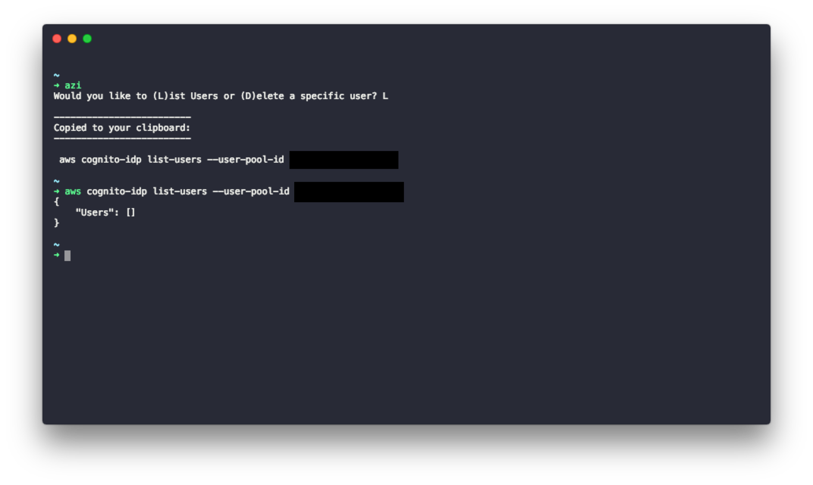

# AWS-ZSH Interpolation



## Install

```
1. brew install awscli # if you don't already have
2. git clone ...
3. export currentUserPoolId='us-region-1_ABCDEFG' #add to your rc
4. alias azi='./path/to/cmd' #add to your rc
```

> Would be great to get this working with a plugin system, but I've never tried before

## Use
```
5. azi #execute from terminal
6. enter "L" or "D" (case insensitive) 
7. paste from clipboard
8. press enter

```

**Trivia**
"rc" (like .bashrc, .zshrc, etc) stems from "runcom"
> [Read More](https://unix.stackexchange.com/questions/3467/what-does-rc-in-bashrc-stand-for)

---


### Shoutout
To Kevin for being in meetings all day

